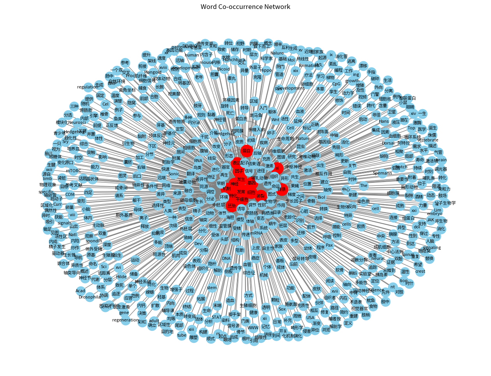

# 🧬 Developmental-Biology-Visualization

Knowledge Mining using NLP, for textbook-level understanding of **Developmental Biology**.

This project aims to extract domain-specific entities and semantic relations from Markdown-formatted biology textbooks, and visualize them through co-occurrence networks and knowledge graphs. It supports both classic NLP (e.g., TF-IDF, co-occurrence) and modern LLM/BERT-based entity-relation extraction workflows.

---

## 📦 Features

- 🔤 **Word Cloud Visualization**: based on textbook word frequency
- 🕸 **Co-occurrence Network**: builds a concept network based on entity co-appearance
- 🧠 **Entity and Relation Extraction**: using either BERT or GPT-based prompts
- 📈 **Network Analysis**: degree centrality, betweenness, Louvain clustering
- 🌐 **Neo4j Graph Integration**: supports full-text–to–graph pipeline
- 🧪 **Pathway Reasoning (Maybe)**: generate concept chains like `gene → pathway → phenotype`

---

## 📸 Screenshots

> Add more results here (e.g., knowledge graph screenshots, community clusters, etc.)

---

## 🚀 RoadMap

We are building this project in modular stages. Here's what's done and what's coming:

### ✅ Completed
- [x] Markdown cleaning and stopword filtering.
- [x] Word frequency statistics and co-occurrence network generation

### 🛠️ In Progress (Project: [My_Academic_Voyage]([https://github.com/Ricardokevins/Bert-In-Relation-Extraction](https://github.com/gameUser6398/My-Academic-Voyage)) has what you want)
- [ ] Basic network analysis (degree, betweenness, modularity)
- [ ] Prompt-based entity & relation extraction using chatECNU (qwen...)
- [ ] Fine-tuning a domain-specific BERT model for NER tasks
- [ ] Exporting structured knowledge as JSON and ingesting into Neo4j
- [ ] Writing computed network metrics (centrality, community) into Neo4j

### 📈 Planned
- [ ] Path-based inference: shortest path & subgraph expansion from key entities
- [ ] Chapter-wise knowledge clustering & comparative evolution over time
- [ ] Interactive graph viewer using Neo4j Bloom or Streamlit
- [ ] Presentation-ready export functions (PNG/SVG for top-K graphs, subgraphs)

---

## 🔗 References & Inspirations

This project draws inspiration from existing open-source efforts in NLP and knowledge graph construction:

- 📌 [BERT-In-Relation-Extraction](https://github.com/Ricardokevins/Bert-In-Relation-Extraction): a PyTorch-based RE model built on top of BERT, great for baseline experiments.
- 📌 [DeepKE](https://github.com/zjunlp/DeepKE): a powerful and modular toolkit for deep learning-based knowledge extraction, including entity, relation, and event extraction.
- 📌 [ECNU NLP Platform](https://developer.ecnu.edu.cn/vitepress/llm/tos.html): practical pipelines and prompt templates for knowledge mining with LLMs.
- 📌 [TechGPT-2.0](https://github.com/neukg/TechGPT-2.0): Knowledge-graph-Oriented Generative Pretrained Transformer 2.0

We refer to these projects when designing our own system architecture, especially for prompt-based RE and visual pipeline structuring.

---

## 🧭 Project Vision: One-Stop Knowledge Graph Toolkit

🎯 **Ultimate Goal**: To develop a one-click platform that transforms biology textbooks and research notes into structured, searchable, and visualizable knowledge graphs.

With this tool, you should be able to:

- 🚀 Upload a textbook (in `.md`, `.pdf`, or `.txt`)
- 🧠 Automatically extract key concepts, definitions, processes, and relationships
- 🌐 Output a full knowledge graph (Neo4j / JSON-LD)
- 📚 Generate a personalized revision summary, concept map, and learning path

> In short: from **raw textbook** → to **graph database** → to **exam-ready review notes** — all in one workflow.

We're actively building this system step by step. Contributions and collaborators are welcome!
